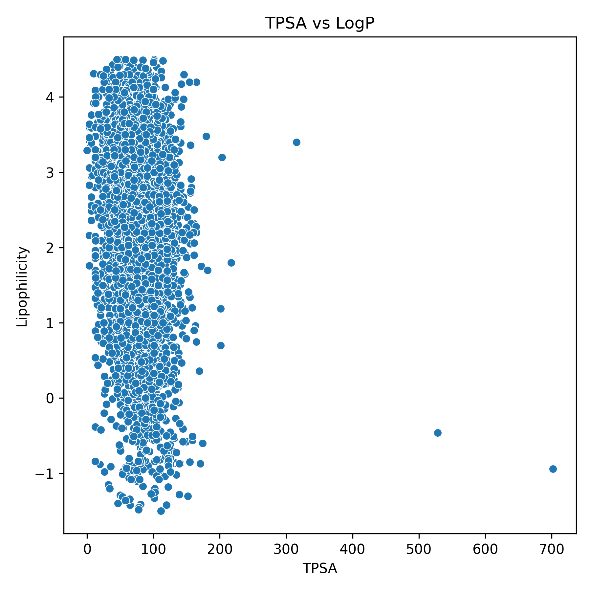
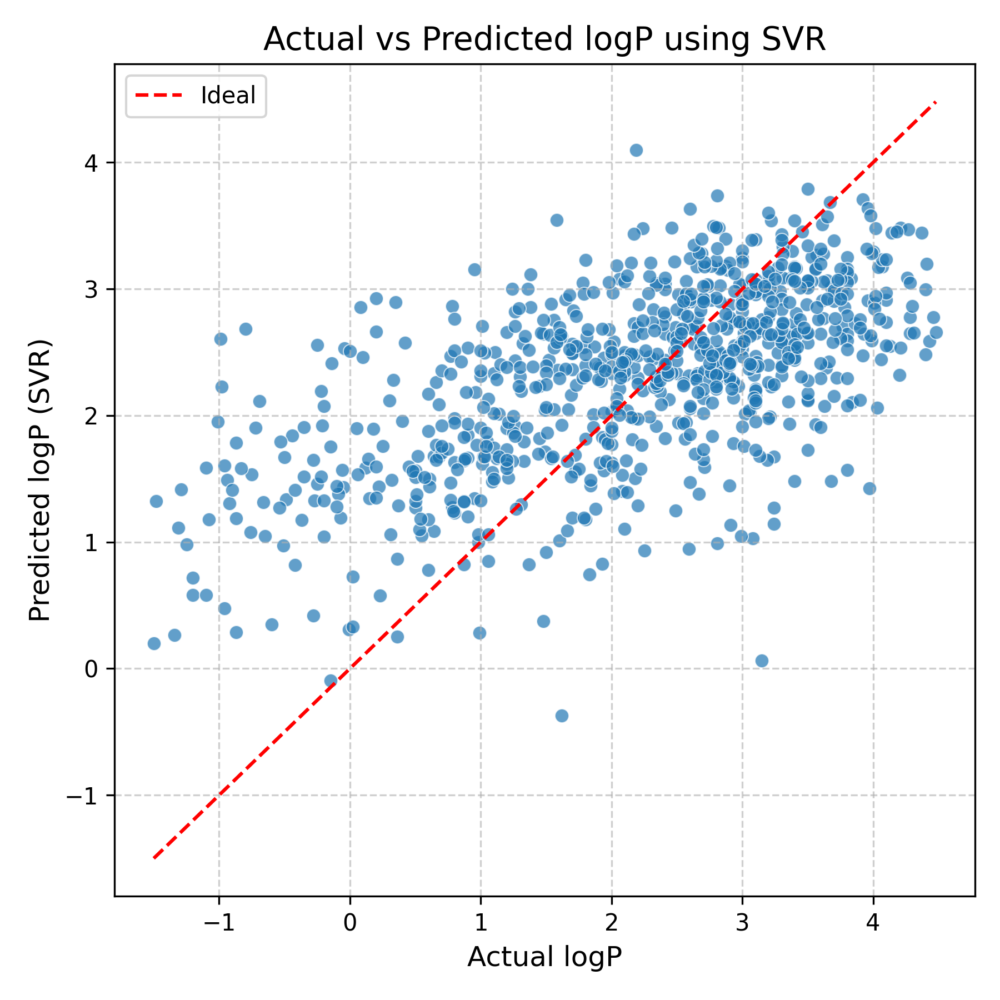

# LogP and TPSA Correlation Analysis

## 🔍 Overview
This project analyzes the correlation between **molecular lipophilicity (LogP)** and **Topological Polar Surface Area (TPSA)** using the `Lipophilicity.csv` dataset.

> 🧑‍🔬 This project was conducted as an independently by a first-year chemical engineering student  
> It demonstrates the use of cheminformatics and machine learning to explore and validate a chemical hypothesis through a computational analysis.

## 🎯 Objective
To validate the chemical hypothesis that:
> Molecules with higher TPSA values tend to have lower LogP values (i.e., more polar → less liposoluble), indicating a negative correlation between the two variables.

## 🙋 Feedback Wanted!
I'm actively improving this project and would love your feedback on:

- Code structure and readability  
- Analysis and visualization  
- Feature engineering ideas  
- Model evaluation and interpretation  

Feel free to open an [Issue](https://github.com/Kyeongbin-Tom/logp-tpsa-analysis/issues) or start a [Discussion](https://github.com/Kyeongbin-Tom/logp-tpsa-analysis/discussions) to share your thoughts!

## 🧭 Motivation
As a first-year chemical engineering student, I became curious about how TPSA (a measure of polarity) influences other molecular properties.  
I hypothesized that lipophilicity (LogP) would be one of the most relevant factors, since it reflects a molecule’s solubility balance between water (polar) and oil (nonpolar) phases.  
This project represents my first attempt to apply data analysis and machine learning techniques to verify a chemical hypothesis.

## 🧠 Background
Lipophilicity (LogP) is a measure of how well a compound dissolves in fat relative to water. Topological Polar Surface Area (TPSA) quantifies the polar regions in the molecule, which are capable of forming hydrogen bonds. TPSA reflects polarity due to its relation to hydrogen bonding capacity. 

In general, highly polar molecules are more hydrophilic and less likely to dissolve in lipid environments.
This leads to the hypothesis that as TPSA increases, LogP tends to decrease - indicating a negative relationship.

## 🧪 Methods
- Data processing using pandas
- Visualization with matplotlib
- Correlation analysis using python
- Machine learning: SVR (Support Vector Regression) to predict the relationship between LogP and TPSA

## 📁 Data Source
- **Lipophilicity.csv**: From the CAIP GitHub repository (CC0 1.0)  
  🔗 [https://github.com/doas1min/CAIP/blob/main/data/Lipophilicity.csv](https://github.com/doas1min/CAIP/blob/main/data/Lipophilicity.csv)
- **TPSA Reference**:  
  Ertl, P., Rohde, B., & Selzer, P. (2000).  
  *Topological polar surface area: A useful descriptor in 2D‑QSAR*.  
  Journal of Medicinal Chemistry, 43(20), 3714‑3717.

## ⚙️ Installation

To install the required dependencies:

```bash
pip install -r requirements.txt

## 📊 Key Findings
- Pearson correlation coefficient between TPSA and LogP: **-0.14**
- Scatter plots reveal a slight inverse trend.
- Supports the hypothesis that higher polarity (TPSA) reduces lipophilicity (LogP).

---

## 🧪 How to Run

You can run the notebook via:

- [](https://colab.research.google.com/github/Kyeongbin-Tom/logp-tpsa-analysis/blob/main/LogP_TPSA_Analysis.ipynb)

- Or clone this repo and run locally:
  ```bash
  pip install pandas seaborn matplotlib
  jupyter notebook notebooks/LogP_TPSA_Analysis.ipynb

⚠️ This notebook is designed for Google Colab.
Some commands (e.g., %pip install, !wget) may not work in local Jupyter environments without modification.

## 📈 Visualizations

### TPSA vs LogP


### SVR Actual vs Predicted



## 📂 Folder Structure

logp-tpsa-analysis/
├── Lipophilicity.csv                # Input dataset (LogP and SMILES)
├── notebooks/
│   └── LogP_TPSA_Analysis.ipynb     # Main Jupyter notebook for analysis
├── src/
│   ├── descriptors.py               # Module for calculating molecular descriptors using RDKit
│   └── visualization.py            # Module for visualizing TPSA and LogP distributions
├── images/                          # Folder for saving generated plots
├── requirements.txt                 # List of required Python packages
└── README.md                        # Project overview and documentation

## 🧰 Python Modules

### 🔬 `src/descriptors.py`
- 

### 📊 `src/visualization.py`
- 
## 🤔 Conclusion
The hypothesis was supported: TPSA appears to negatively correlate with LogP. The correlation was lower than initially expected, but Machine learning models effectively demonstrated the relationship.

## 💡 Future Work
- Try deeplearning models for higher accuracy.
- Identify other molecular descriptors that correlate more strongly with LogP

## 📌 License

The dataset (Lipophilicity.csv) is distributed under the
CC0 1.0 Public Domain Dedication.
This project is for educational and non-commercial purposes only.


## 📝 Citation

Ertl, P., Rohde, B., & Selzer, P. (2000).
Topological polar surface area: A useful descriptor in 2D-QSAR.
Journal of Medicinal Chemistry, 43(20), 3714–3717.
